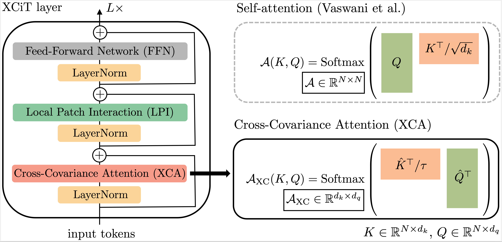
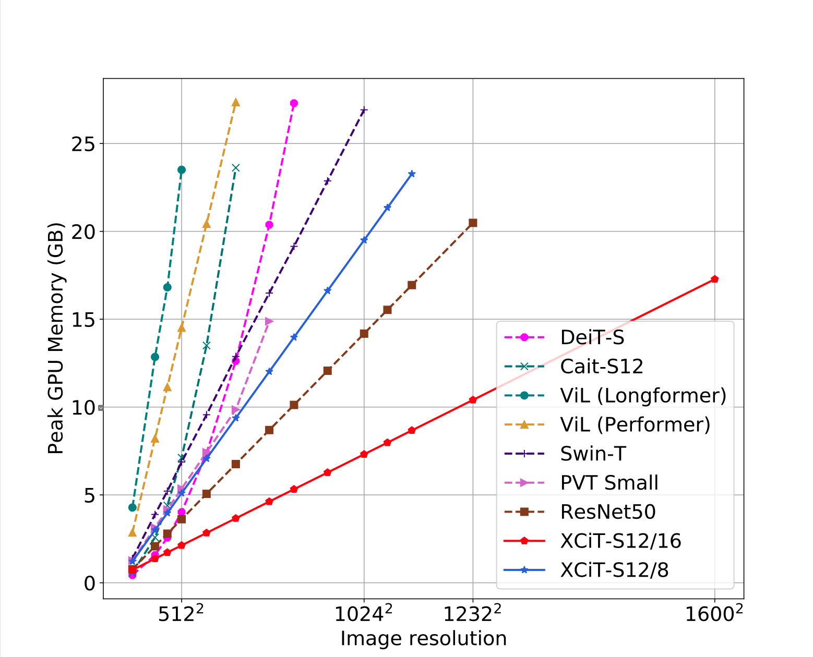
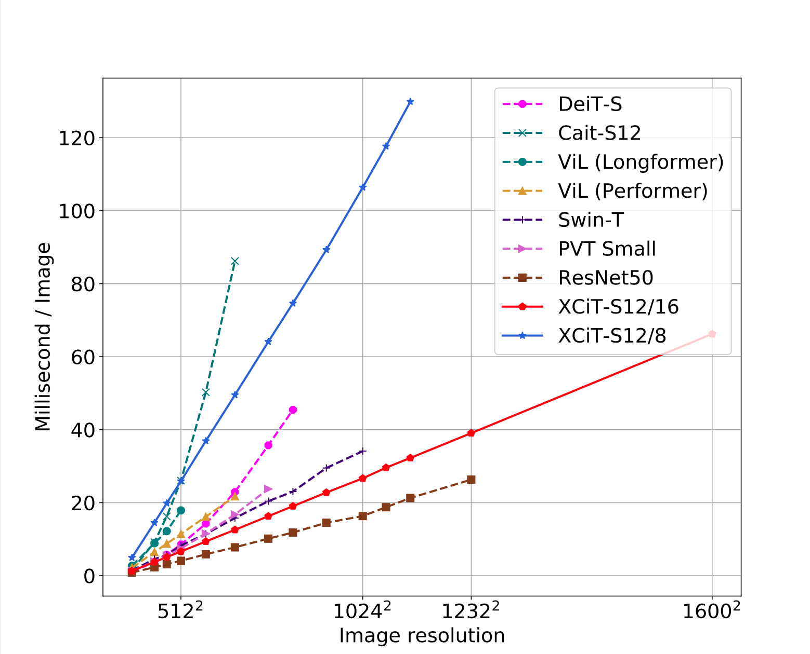

# Cross-Covariance Image Transformer (XCiT)


PyTorch implementation and pretrained models for XCiT models. See **XCiT: Cross-Covariance Image Transformer**

[[`arXiv`](https://arxiv.org/pdf/2106.09681.pdf)] [[`Yannic Kilcher's video`](https://www.youtube.com/watch?v=g08NkNWmZTA)]


<!-- ### Cross-Covariance Attention (XCA) -->

<p align="center">

</p>

### Linear complexity in time and memory


Our XCiT models has a linear complexity w.r.t number of patches/tokens: 


<!--  
 -->
  |  
:-------------------------:|:-------------------------:
Peak Memory (inference)    | Millisecond/Image (Inference)

## Scaling to high resolution inputs

XCiT can scale to high resolution inputs both due to cheaper compute requirement as well as better adaptability to higher resolution at test time (see Figure 3 in the paper) 
<!-- . pixel-level image classification where we can obtain pixel-level attention maps (middle) as well as scaling to high resolution tasks like object detection and instance segmentation (right).
 -->
 
 ### Detection and Instance Segmentation for Ultra high resolution images (6000x4000)
 

)


<!-- ### DINO on steroids :t-rex: :zap: -->
### XCiT+[DINO](https://github.com/facebookresearch/dino): High Res. Self-Attention Visualization :t-rex:

Our XCiT models with self-supervised training using DINO can obtain high resolution attention maps.


https://user-images.githubusercontent.com/8495451/122425895-1c2ec700-cf90-11eb-9352-dc6731c467d2.mp4


**Self-Attention visualization per head**

Below we show the attention maps for each of the 8 heads separately and we can observe that every head specializes in different semantic aspects of the scene for the foreground as well as the background.

https://user-images.githubusercontent.com/8495451/122425825-0f11d800-cf90-11eb-999e-4cffd86a6ec6.mp4


---

# Getting Started

First, clone the repo
```
git clone https://github.com/facebookresearch/XCiT.git
```

Then, you can install the required packages including: [Pytorch](https://pytorch.org/) version 1.7.1, [torchvision](https://pytorch.org/vision/stable/index.html) version 0.8.2 and [Timm](https://github.com/rwightman/pytorch-image-models) version 0.4.8
```
pip install -r requirements.txt
```

Download and extract the [ImageNet](https://imagenet.stanford.edu/) dataset. Afterwards, set the ```--data-path``` argument to the corresponding extracted ImageNet path.

For full details about all the available arguments, you can use
```
python main.py --help
```

For detection and segmentation downstream tasks, please check: 
+ COCO Object detection and Instance segmentation: [XCiT Detection](detection/)

+ ADE20k Semantic segmentation: [XCiT Semantic Segmentation](semantic_segmentation/)

---

## Model Zoo

We provide XCiT models pre-trained weights on ImageNet-1k.

`§: distillation`


<!-- <details><summary><b>Models with 16x16 patch size</b></summary> -->
### Models with 16x16 patch size

<table>
  <tr>
    <th>Arch</th>
    <!-- <th>key</th> -->
    <th>params</th>
    <!-- <th>GFLOPS</th> -->
    <!-- <th>Top-1</th> -->
    <!-- <th>linear</th> -->
    <th colspan="6">Model</th>
  </tr>
  <tr>
    <!-- <th></th> -->
    <!-- <th></th> -->
    <th></th>
    <!-- <th></th> -->
    <th></th>
    <!-- <th>linear</th> -->
    <th colspan="2">224</th>
    <th colspan="2">224 § </th>
    <th colspan="2">384 § </th>
  </tr>
   <tr>
    <!-- <th></th> -->
    <!-- <th></th> -->
    <th></th>
    <!-- <th></th> -->
    <th></th>
    <!-- <th>linear</th> -->
    <th>top-1</th>
    <th>weights</th>
    <th>top-1</th>
    <th>weights</th>
    <th>top-1</th>
    <th>weights</th>
 </tr>
  <tr>
    <!-- <td>XCiT-N12/16</td> -->
    <td><em>xcit_nano_12_p16</em></td>
    <td>3M</td>
    <td>69.9%</td>
    <td><a href="https://dl.fbaipublicfiles.com/xcit/xcit_nano_12_p16_224.pth">download</a></td>
    <td>72.2%</td>
    <td><a href="https://dl.fbaipublicfiles.com/xcit/xcit_nano_12_p16_224_dist.pth">download</a></td>
    <td>75.4%</td>
    <td><a href="https://dl.fbaipublicfiles.com/xcit/xcit_nano_12_p16_384_dist.pth">download</a></td>
  </tr>
    <tr>
    <!-- <td>XCiT-T12/16</td> -->
    <td><em>xcit_tiny_12_p16</em></td>
    <td>7M</td>
    <td>77.1%</td>
    <td><a href="https://dl.fbaipublicfiles.com/xcit/xcit_tiny_12_p16_224.pth">download</a></td>
    <td>78.6%</td>
    <td><a href="https://dl.fbaipublicfiles.com/xcit/xcit_tiny_12_p16_224_dist.pth">download</a></td>
    <td>80.9%</td>
    <td><a href="https://dl.fbaipublicfiles.com/xcit/xcit_tiny_12_p16_384_dist.pth">download</a></td>
  </tr>
    <tr>
    <!-- <td>XCiT-T24/16</td> -->
    <td><em>xcit_tiny_24_p16</em></td>
    <td>12M</td>
    <td>79.4%</td>
    <td><a href="https://dl.fbaipublicfiles.com/xcit/xcit_tiny_24_p16_224.pth">download</a></td>
    <td>80.4%</td>
    <td><a href="https://dl.fbaipublicfiles.com/xcit/xcit_tiny_24_p16_224_dist.pth">download</a></td>
    <td>82.6%</td>
    <td><a href="https://dl.fbaipublicfiles.com/xcit/xcit_tiny_24_p16_384_dist.pth">download</a></td>
  </tr>
    <tr>
    <!-- <td>XCiT-S12/16</td> -->
    <td><em>xcit_small_12_p16</em></td>
    <td>26M</td>
    <td>82.0%</td>
    <td><a href="https://dl.fbaipublicfiles.com/xcit/xcit_small_12_p16_224.pth">download</a></td>
    <td>83.3%</td>
    <td><a href="https://dl.fbaipublicfiles.com/xcit/xcit_small_12_p16_224_dist.pth">download</a></td>
    <td>84.7%</td>
    <td><a href="https://dl.fbaipublicfiles.com/xcit/xcit_small_12_p16_384_dist.pth">download</a></td>
  </tr>
    <tr>
    <!-- <td>XCiT-S24/16</td> -->
    <td><em>xcit_small_24_p16</em></td>
    <td>48M</td>
    <td>82.6%</td>
    <td><a href="https://dl.fbaipublicfiles.com/xcit/xcit_small_24_p16_224.pth">download</a></td>
    <td>83.9%</td>
    <td><a href="https://dl.fbaipublicfiles.com/xcit/xcit_small_24_p16_224_dist.pth">download</a></td>
    <td>85.1%</td>
    <td><a href="https://dl.fbaipublicfiles.com/xcit/xcit_small_24_p16_384_dist.pth">download</a></td>
  </tr>
    <tr>
    <!-- <td>XCiT-M24/16</td> -->
    <td><em>xcit_medium_24_p16</em></td>
    <td>84M</td>
    <td>82.7%</td>
    <td><a href="https://dl.fbaipublicfiles.com/xcit/xcit_medium_24_p16_224.pth">download</a></td>
    <td>84.3%</td>
    <td><a href="https://dl.fbaipublicfiles.com/xcit/xcit_medium_24_p16_224_dist.pth">download</a></td>
    <td>85.4%</td>
    <td><a href="https://dl.fbaipublicfiles.com/xcit/xcit_medium_24_p16_384_dist.pth">download</a></td>
  </tr>
    <tr>
    <!-- <td>XCiT-L24/16</td> -->
    <td><em>xcit_large_24_p16</em></td>
    <td>189M</td>
    <td>82.9%</td>
    <td><a href="https://dl.fbaipublicfiles.com/xcit/xcit_large_24_p16_224.pth">download</a></td>
    <td>84.9%</td>
    <td><a href="https://dl.fbaipublicfiles.com/xcit/xcit_large_24_p16_224_dist.pth">download</a></td>
    <td>85.8%</td>
    <td><a href="https://dl.fbaipublicfiles.com/xcit/xcit_large_24_p16_384_dist.pth">download</a></td>
  </tr>
</table>


<!-- </details> -->

<!-- <details><summary><b>Models with 8x8 patch size</b></summary> -->

### Models with 8x8 patch size
<table>
  <tr>
    <th>Arch</th>
    <!-- <th>key</th> -->
    <th>params</th>
    <!-- <th>GFLOPS</th> -->
    <!-- <th>Top-1</th> -->
    <!-- <th>linear</th> -->
    <th colspan="6">Model</th>
  </tr>
  <tr>
    <!-- <th></th> -->
    <th></th>
    <!-- <th></th> -->
    <!-- <th></th> -->
    <th></th>
    <!-- <th>linear</th> -->
    <th colspan="2">224</th>
    <th colspan="2">224 § </th>
    <th colspan="2">384 § </th>
 </tr>
   <tr>
    <!-- <th></th> -->
    <th></th>
    <!-- <th></th> -->
    <!-- <th></th> -->
    <th></th>
    <!-- <th>linear</th> -->
    <th>top-1</th>
    <th>weights</th>
    <th>top-1</th>
    <th>weights</th>
    <th>top-1</th>
    <th>weights</th>
 </tr>
  <tr>
    <!-- <td>XCiT-N12/8</td> -->
    <td><em>xcit_nano_12_p8</em></td>
    <td>3M</td>
    <td>73.8%</td>
    <td><a href="https://dl.fbaipublicfiles.com/xcit/xcit_nano_12_p8_224.pth">download</a></td>
    <td>76.3%</td>
    <td><a href="https://dl.fbaipublicfiles.com/xcit/xcit_nano_12_p8_224_dist.pth">download</a></td>
    <td>77.8%</td>
    <td><a href="https://dl.fbaipublicfiles.com/xcit/xcit_nano_12_p8_384_dist.pth">download</a></td>
  </tr>
    <tr>
    <!-- <td>XCiT-T12/8</td> -->
    <td><em>xcit_tiny_12_p8</em></td>
    <td>7M</td>
    <td>79.7%</td>
    <td><a href="https://dl.fbaipublicfiles.com/xcit/xcit_tiny_12_p8_224.pth">download</a></td>
    <td>81.2%</td>
    <td><a href="https://dl.fbaipublicfiles.com/xcit/xcit_tiny_12_p8_224_dist.pth">download</a></td>
    <td>82.4%</td>
    <td><a href="https://dl.fbaipublicfiles.com/xcit/xcit_tiny_12_p8_384_dist.pth">download</a></td>
  </tr>
    <tr>
    <!-- <td>XCiT-T24/8</td> -->
    <td><em>xcit_tiny_24_p8</em></td>
    <td>12M</td>
    <td>81.9%</td>
    <td><a href="https://dl.fbaipublicfiles.com/xcit/xcit_tiny_24_p8_224.pth">download</a></td>
    <td>82.6%</td>
    <td><a href="https://dl.fbaipublicfiles.com/xcit/xcit_tiny_24_p8_224_dist.pth">download</a></td>
    <td>83.7%</td>
    <td><a href="https://dl.fbaipublicfiles.com/xcit/xcit_tiny_24_p8_384_dist.pth">download</a></td>
  </tr>
    <tr>
    <!-- <td>XCiT-S12/8</td> -->
    <td><em>xcit_small_12_p8</em></td>
    <td>26M</td>
    <td>83.4%</td>
    <td><a href="https://dl.fbaipublicfiles.com/xcit/xcit_small_12_p8_224.pth">download</a></td>
    <td>84.2%</td>
    <td><a href="https://dl.fbaipublicfiles.com/xcit/xcit_small_12_p8_224_dist.pth">download</a></td>
    <td>85.1%</td>
    <td><a href="https://dl.fbaipublicfiles.com/xcit/xcit_small_12_p8_384_dist.pth">download</a></td>
  </tr>
    <tr>
    <!-- <td>XCiT-S24/8</td> -->
    <td><em>xcit_small_24_p8</em></td>
    <td>48M</td>
    <td>83.9%</td>
    <td><a href="https://dl.fbaipublicfiles.com/xcit/xcit_small_24_p8_224.pth">download</a></td>
    <td>84.9%</td>
    <td><a href="https://dl.fbaipublicfiles.com/xcit/xcit_small_24_p8_224_dist.pth">download</a></td>
    <td>85.6%</td>
    <td><a href="https://dl.fbaipublicfiles.com/xcit/xcit_small_24_p8_384_dist.pth">download</a></td>
  </tr>
    <tr>
    <!-- <td>XCiT-M24/8</td> -->
    <td><em>xcit_medium_24_p8</em></td>
    <td>84M</td>
    <td>83.7%</td>
    <td><a href="https://dl.fbaipublicfiles.com/xcit/xcit_medium_24_p8_224.pth">download</a></td>
    <td>85.1%</td>
    <td><a href="https://dl.fbaipublicfiles.com/xcit/xcit_medium_24_p8_224_dist.pth">download</a></td>
    <td>85.8%</td>
    <td><a href="https://dl.fbaipublicfiles.com/xcit/xcit_medium_24_p8_384_dist.pth">download</a></td>
  </tr>
    <tr>
    <!-- <td>XCiT-L24/8</td> -->
    <td><em>xcit_large_24_p8</em></td>
    <td>189M</td>
    <td>84.4%</td>
    <td><a href="https://dl.fbaipublicfiles.com/xcit/xcit_large_24_p8_224.pth">download</a></td>
    <td>85.4%</td>
    <td><a href="https://dl.fbaipublicfiles.com/xcit/xcit_large_24_p8_224_dist.pth">download</a></td>
    <td>86.0%</td>
    <td><a href="https://dl.fbaipublicfiles.com/xcit/xcit_large_24_p8_384_dist.pth">download</a></td>
  </tr>
</table>

### XCiT + DINO Self-supervised models 

<table>
  <tr>
    <th>Arch</th>
    <!-- <th>key</th> -->
    <th>params</th>
    <th>k-nn</th>
    <th>linear</th>
    <th>download</th>
  </tr>
    <tr>
    <!-- <td>XCiT-S12/8</td> -->
    <td><em>xcit_small_12_p16</em></td>
    <td>26M</td>
    <td>76.0%</td>
    <td>77.8%</td>
    <td><a href="https://dl.fbaipublicfiles.com/xcit/xcit_small_12_cp16_dino.pth ">backbone</a></td>
      <tr>
    <!-- <td>XCiT-S12/8</td> -->
    <td><em>xcit_small_12_p8</em></td>
    <td>26M</td>
    <td>77.1%</td>
    <td>79.2%</td>
    <td><a href="https://dl.fbaipublicfiles.com/xcit/xcit_small_12_cp8_dino.pth">backbone</a></td>
      <tr>
    <td><em>xcit_medium_24_p16</em></td>
    <td>84M</td>
    <td>76.4%</td>
    <td>78.8%</td>
    <td><a href="https://dl.fbaipublicfiles.com/xcit/xcit_medium_24_cp16_dino.pth">backbone</a></td>
    <tr>
    <td><em>xcit_medium_24_p8</em></td>
    <td>84M</td>
    <td>77.9%</td>
    <td>80.3%</td>
    <td><a href="https://dl.fbaipublicfiles.com/xcit/xcit_medium_24_cp8_dino.pth">backbone</a></td>
</table>

---

<!-- ## Usage -->


### Training

For training using a single node, use the following command

```
python -m torch.distributed.launch --nproc_per_node=[NUM_GPUS] --use_env main.py --model [MODEL_KEY] --batch-size [BATCH_SIZE] --drop-path [STOCHASTIC_DEPTH_RATIO] --output_dir [OUTPUT_PATH]
```
For example, the XCiT-S12/16 model can be trained using the following command

```
python -m torch.distributed.launch --nproc_per_node=8 --use_env main.py --model xcit_small_12_p16 --batch-size 128 --drop-path 0.05 --output_dir /experiments/xcit_small_12_p16/ --epochs [NUM_EPOCHS]
```

For multinode training via SLURM you can alternatively use 
```
python run_with_submitit.py --partition [PARTITION_NAME] --nodes 2 --ngpus 8 --model xcit_small_12_p16 --batch-size 64 --drop-path 0.05 --job_dir /experiments/xcit_small_12_p16/ --epochs 400
```

More details for the hyper-parameters used to train the different models can be found in Table B.1 in the paper.

### Evaluation
To evaluate an XCiT model using the checkpoints above or models you trained use the following command:  
```
python main.py --eval --model <MODEL_KEY> --input-size <IMG_SIZE> [--full_crop] --pretrained <PATH/URL>
```

By default we use the ```--full_crop```  flag which evaluates the model with a crop ratio of 1.0 instead of 0.875 following [CaiT](https://github.com/facebookresearch/deit/blob/main/README_cait.md).

For example, the command to evaluate the XCiT-S12/16 using 224x224 images: 
```
python main.py --eval --model xcit_small_12_p16 --input-size 384 --full_crop --pretrained https://dl.fbaipublicfiles.com/xcit/xcit_small_12_p16_224.pth
```
---

<!-- </details> -->

## Acknowledgement 
This repository is built using the [Timm](https://github.com/rwightman/pytorch-image-models) library and the [DeiT](https://github.com/facebookresearch/deit) repository. The self-supervised training is based on the [DINO](https://github.com/facebookresearch/dino) repository.


## License
This repository is released under the Apache 2.0 license as found in the [LICENSE](LICENSE) file.

## Contributing
We actively welcome your pull requests! Please see [CONTRIBUTING.md](.github/CONTRIBUTING.md) and [CODE_OF_CONDUCT.md](.github/CODE_OF_CONDUCT.md) for more info.


## Citation
If you find this repository useful, please consider citing our work:
```
@article{el2021xcit,
  title={XCiT: Cross-Covariance Image Transformers},
  author={El-Nouby, Alaaeldin and Touvron, Hugo and Caron, Mathilde and Bojanowski, Piotr and Douze, Matthijs and Joulin, Armand and Laptev, Ivan and Neverova, Natalia and Synnaeve, Gabriel and Verbeek, Jakob and others},
  journal={arXiv preprint arXiv:2106.09681},
  year={2021}
}
```
